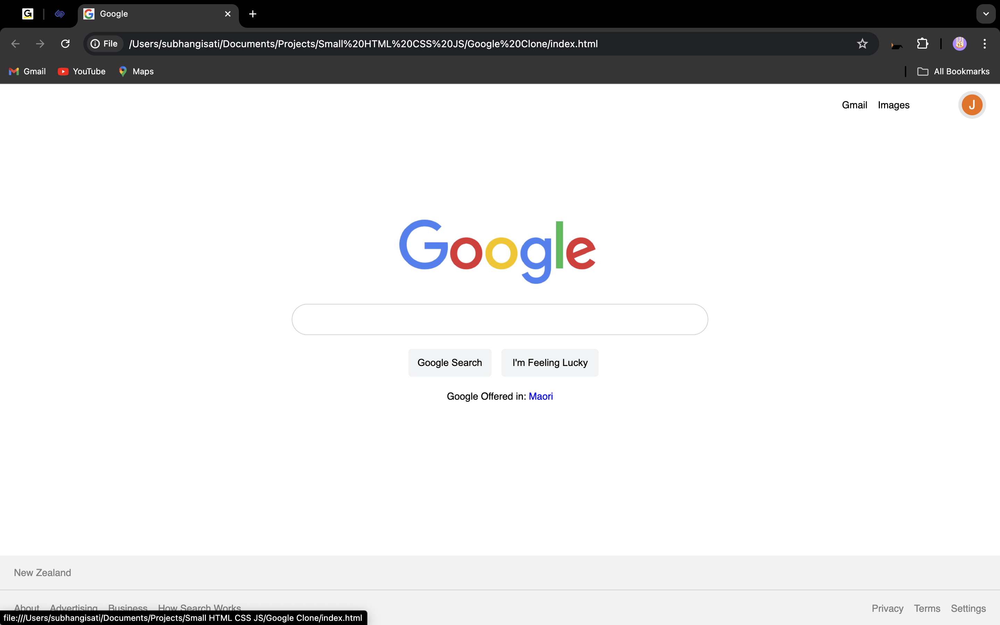

# Google Search Engine Clone

An impressive project to dive into web development! This Google Search Engine Clone replicates the look and feel of the original Google search page and includes functional search capabilities.

## Features

- **Accurate Design**: Mimics the original Google search interface.
- **Functional Search**: Allows users to search for information.

## Technologies Used

- **HTML**: For structuring the content.
- **CSS**: For styling and layout.
- **JavaScript**: For adding interactivity and search functionality.

## Screenshot

## Getting Started

### Prerequisites

To run this project locally, you need a web browser.

## Usage

- Enter your search query in the search bar and hit "Enter" or click the "Search" button to see the results.
- Customize the styles or functionality as per your needs by editing the HTML, CSS, and JavaScript files.

