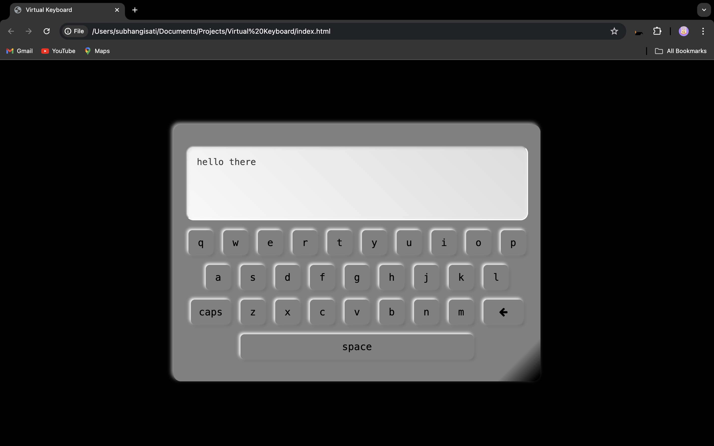

<h1>Virtual Keyboard using JavaScript</h1>

A fully functional on-screen keyboard with a display area to show typed characters.

### Project Purpose:

Allows users to type using a virtual keyboard, with the typed characters displayed in real-time.

<h3>Technologies Used</h3>
<ul>
  <li>HTML5</li>
  <li>CSS3</li>
  <li>JavaScript</li>
</ul>

#### Steps to Use:

1. Navigate to the project directory.
2. Open the `index.html` file in your browser.
3. Start typing using the virtual keyboard!

<h3>Screenshots</h3>

 
