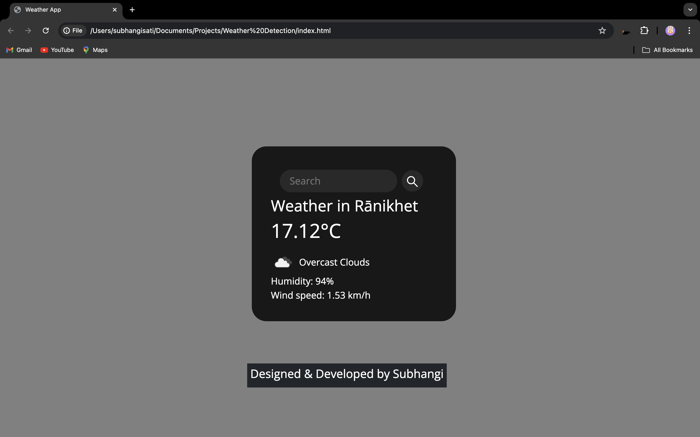

<h1>WeatherApp</h1>

Simple Weather app written in HTML, CSS, and JavaScript using the APIs for fetching weather and geolocation information.
It only requires input of a location and provides with the temperature of that place with a very quick response

<h3>Technologies Used </h3>
<ul>
  <li>HTML5</li>
  <li>CSS3</li>
  <li>JavaScript</li>
</ul>

<h3>APIs Used </h4>
<ul>
  <li>Open Weather API</li>
 <li>Unsplash API</li>
</ul>

<h3> Sample Image </h3>  

 
