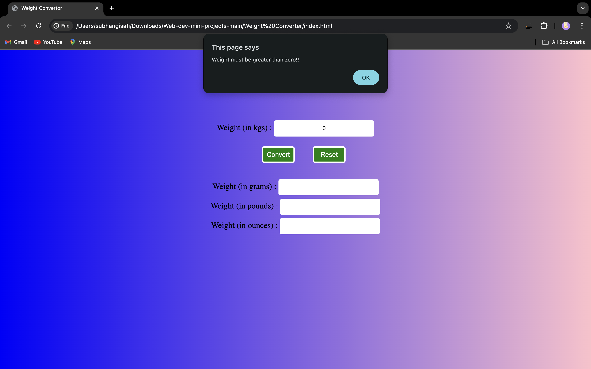
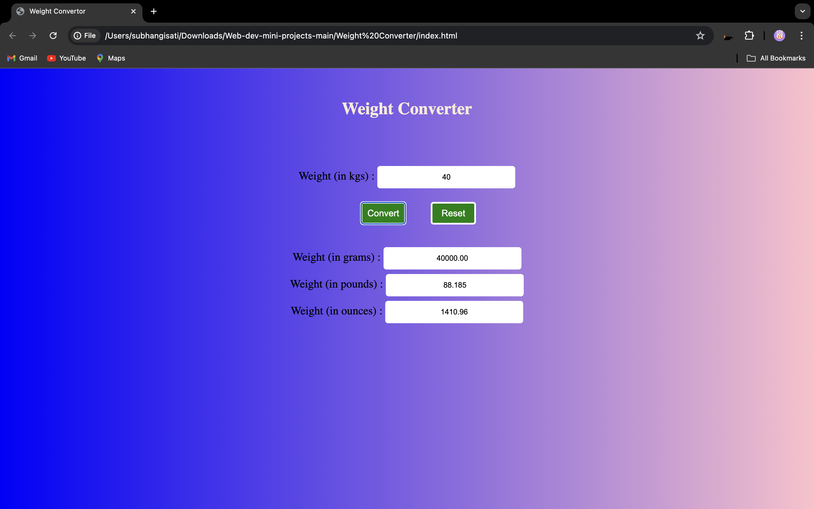

# Weight Converter

A basic Weight Converter project where users can enter a weight in kilograms and convert it to grams, pounds, and ounces.

## Purpose of the Project

### For Users:
- Simplifies the task of converting weights by eliminating the need for manual calculations.

### For Developers:
- Serves as a beginner-friendly project to practice and learn web development skills.

## Technologies Used
- HTML
- CSS

## Screenshots

### 1. Alert for No Value or Invalid Value
When no value is entered or the value is less than or equal to zero, an alert appears:

### 2. Successful Conversion
Upon entering a valid value and clicking the Convert button, the weight is successfully converted:

